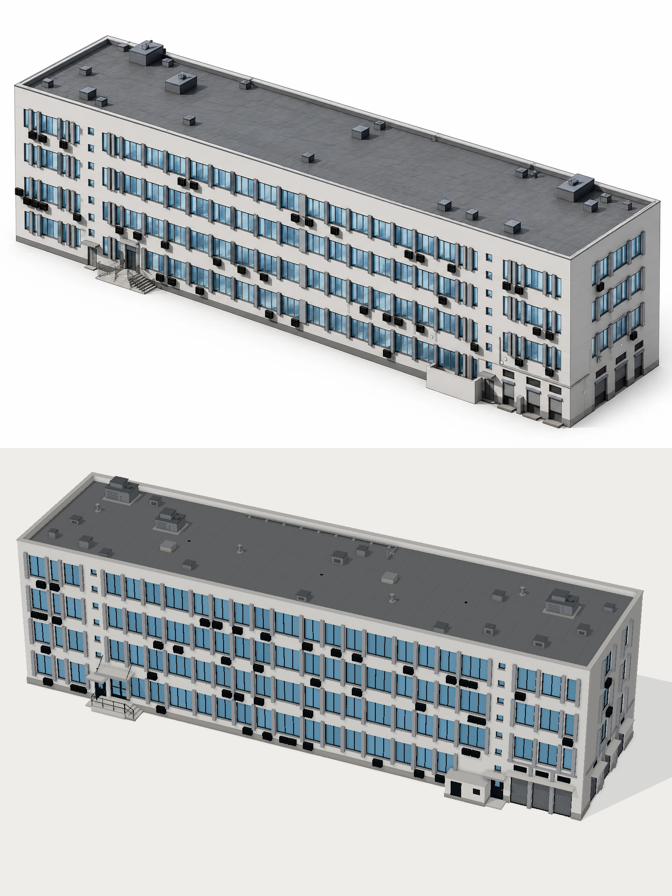

# Institutional building – procedural Three.js reconstruction

Interactive 3D reconstruction of a long 4-storey institutional/office building with a flat roof.
Everything is built as real geometry. No part of the facade is a texture: openings are cut
through an extruded wall skin, and windows, fins, AC units, stairs and roof equipment are
individual (instanced) 3D elements.

```bash
npm install
npm run dev      # http://localhost:5173
npm run build    # production build in dist/
```

## Controls

* Left mouse: rotate · wheel: zoom · right mouse: pan (damped; distance and target are clamped)
* W/A/S/D or arrows: move the camera together with its pivot · Q/E: down/up · Shift: faster
* Double-click a surface: make it the new rotation pivot · single click on a 4th-floor room: select it in the Rooms panel
* **Walk** (*Views* or *Camera* folder): first-person mode, drag to look around, WASD to walk, Q/E down/up, wheel steps forward, Esc exits. It starts exactly from the current camera position; the *Camera* folder has move speed and lens (field of view) sliders.
* Panel → **Views**: camera presets (Front Right, Front, Front Left, Top Isometric, Right Side, Roof), 4th floor cutaway, stair-shaft section, walk mode and Reset camera (● marks the active view)
* **Reset all** (top of the panel) restores every parameter, colour, display option and the camera to the defaults in `src/config.js`
* Each panel section also has its own reset: **Default display**, **Default parameters** (one rebuild with the default geometry) and **Default colours**
* lil-gui panel:
  * **Display**: toggle roof, HVAC, fins, windows, shadows, ambient occlusion (GTAO) and wireframe; set sun intensity; reset the camera
  * **Parameters (rebuild)**: width, depth, floors, floor height, parapet height, number of window modules, pane width, window height, sill height, HVAC density, random seed
  * **Walls & interior**: per-facade walls, front wall of the stair shafts (hides only the strips with the small windows), 4th-floor exterior walls & windows (the facade band of that storey on all sides, with its windows, fins and AC units), 4th-floor walls & doors, stair-core walls, slabs, room names, doors < 900 mm, stairs (highlight colour, transparent flights)
  * **Front additions** (independent of the facade toggles): entrance porch & steps, canopies, technical annex (with an editable 4-digit sign, repeated on the ground as "КОД: …."), basement stair under a lean-to canopy, route arrows on the ground, entrance/utility doors, roller shutters & grilles
  * **Section (stair shafts)**: vertical section cut that removes everything in front of it except the stairs, so both shafts read through all floors; adjustable cut depth. Also *Stair shafts* in **Views**
  * **Rooms (4th floor)**: click a room on the 4th floor to select it (orange outline) and edit it here; hide all walls and doors while keeping the plan markup on the floor; per room (drop-down): colour the floor, show/hide the name, arrow from the room's doorway to the nearest stairs (with the stair and route length); *Only this room*, arrows from every room, show/hide all names, clear colours. Routes follow corridors and doorways with straight segments and 90° turns (grid path-finding with a turn penalty on the traced plan, `src/routes.js`)
  * **Arrows**: route style (animated dashes and arrows "-→-→" or solid line), animation on/off, speed, spacing, colour – applies to room routes and the arrows in front of the building
  * **Views → snapshot**: renders the current camera view at ×1–×4 resolution (up to 8192 px) with a doubled shadow map and denser AO and saves a PNG (in claude.ai via the downloads capability, locally as a normal download)
  * **Colours**: facade, side, plinth, fins, glass, frames, roof, HVAC and metal (applied live)

`window.app` is exposed in the browser console for inspection (`app.building().layout`, `app.rebuild()` …).

## Structure

| File | Purpose |
| --- | --- |
| `src/config.js` | All parameters and named dimension constants (no magic numbers elsewhere) |
| `src/layout.js` | Pure layout step: facade zones, window groups, fin positions, openings, HVAC distribution |
| `src/building.js` | `Building extends THREE.Group`: core mass, coping, facades, roof; toggleable layers |
| `src/facade.js` | Extruded wall skin with real openings, plinth, dispatch of opening contents |
| `src/windows.js` | `createWindowModule`, `createWindowGroup`, `createSquareWindow`, `createVerticalFin` |
| `src/hvac.js` | `createHVACUnit` (casing, fan, grille bars, louvres, brackets) |
| `src/entrance.js` | `createEntrance` (recessed double doors, canopy, landing, stepped stair, railings), `createSmallDoor` |
| `src/serviceArea.js` | Roller shutters, ventilation grilles, pilasters, band, utility enclosure |
| `src/roof.js` | Roof membrane, `createRoofUnit` (AHUs, boxes, vents, hatches, drains), pipe run |
| `src/materials.js` | PBR material palette (procedural plaster and roof textures) |
| `src/scene.js` | Renderer, lights, shadows, environment, GTAO post-processing, camera, controls, presets |
| `src/ui.js` | lil-gui panel and preset buttons |

Coordinates: X = length, Y = height (ground at Y = 0), Z = depth, main facade toward +Z, building centred at the origin.

Depth layering on the facade: wall face → recessed frame and glass (−0.14 m) → projecting sill →
fins (+0.26 m) → AC units further out. Repeated parts go into `InstancedMesh` buckets, so the
whole building is about 50 draw calls.

## Matching the reference



The model was checked against the reference image by rendering it headlessly from the
**Front Right** preset and comparing the two side by side. Several passes adjusted:
* overall proportions (50 × 13 × 14 m)
* facade zoning: 5.8 m left wing, 1.6 m stair strips, 17-module central zone, 5.8 m right wing
* the window/fin rhythm
* AC density
* colours
* the camera: long lens (FOV 10°), about 24° azimuth, 33° elevation, which gives the
  near-axonometric look of the reference

The reference appears to have somewhat squatter floors than the requested 3.2–3.8 m range.
The model uses the lower bound (3.2 m) to stay within the spec.
